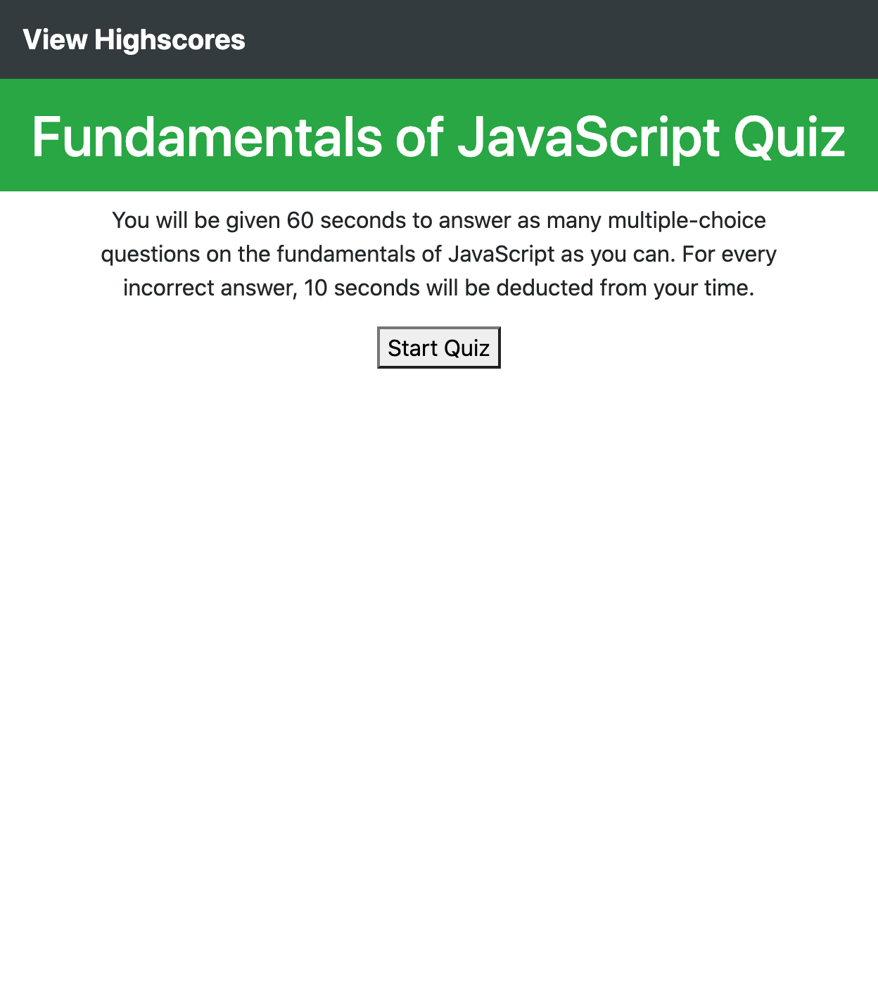
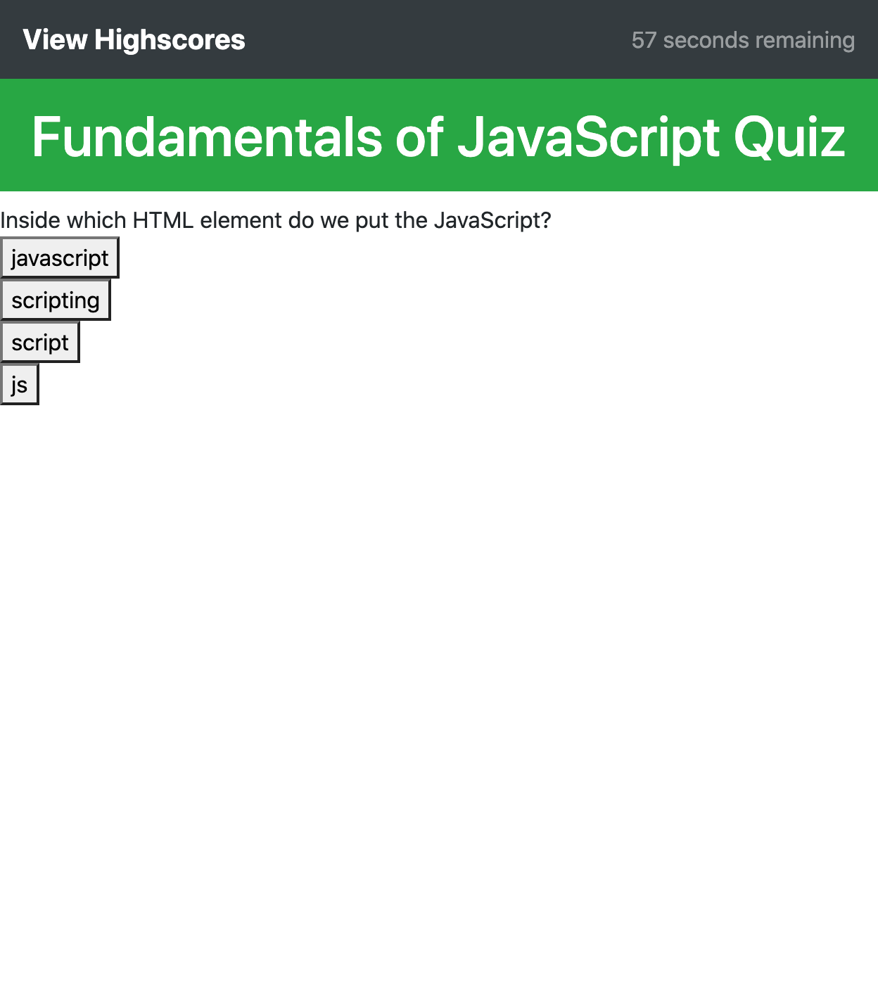
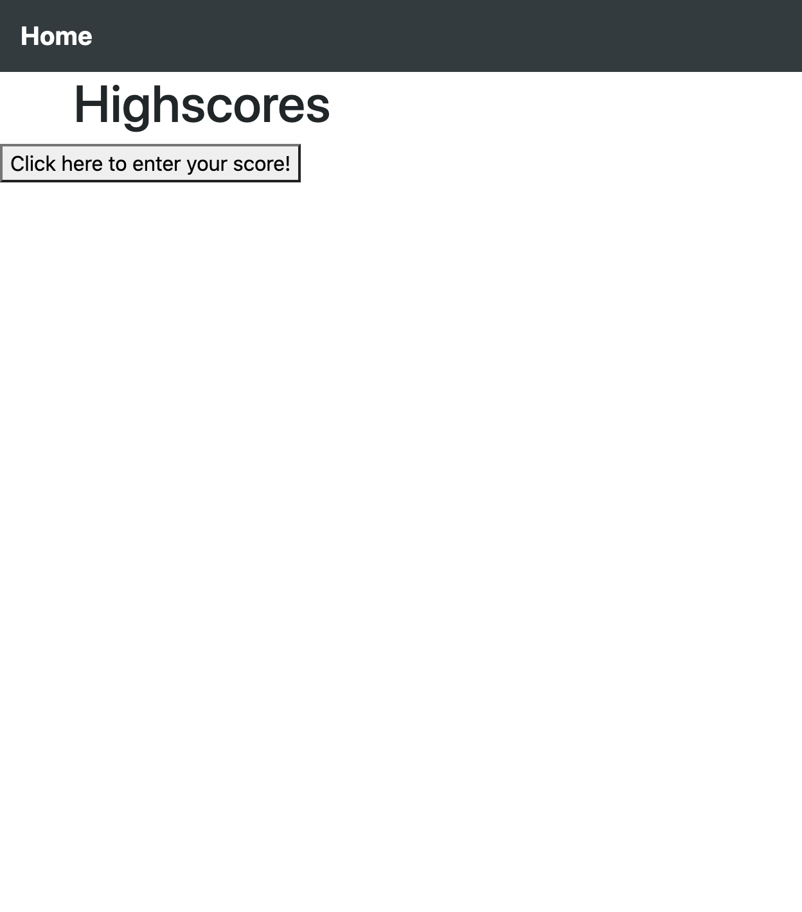
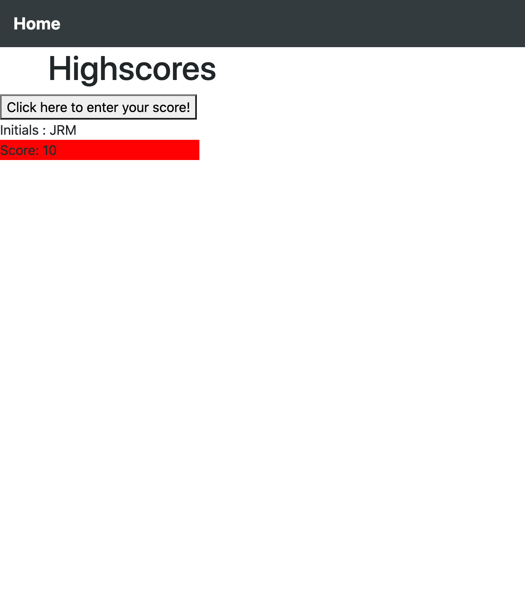

# code-quiz

This application is a timed quiz on the fundamentals of JavaScript

-The user clicks the "Start Quiz" button to initiate the quiz.
    -A 60 second timer begins to countdown after the "Start Quiz" has been clicked and the user is presented with the first multiple choice question.
-The user takes the quiz by reading the question and clicking on an answer button.
    -If the answer is CORRECT then an alert will show "Correct!" and the user is presented with the next question after "OK" is clicked on the alert.
    -If the answer is INCORRECT then an alert will show "Wrong!!" and the user will have to answer the same question again after "OK" is clicked on the alert.
        -10 seconds are deducted from the time remaining if the user selects an incorrect answer.
-The quiz ends if either the time remaining reaches 0 or the user answers the last (10th) question.
-When the quiz ends, the user is redirected to the "Highscores" page.
    -The user may enter their score by clicking on the "Click here to enter your score!" button.
        -When the user clicks the button, they are presented with a PROMPT that asks the user for their initials.
        -When the user enters their intials and presses "OK", their initials appear along with their score.
-The user may take the quiz again by clicking "Home" on the navbar.

